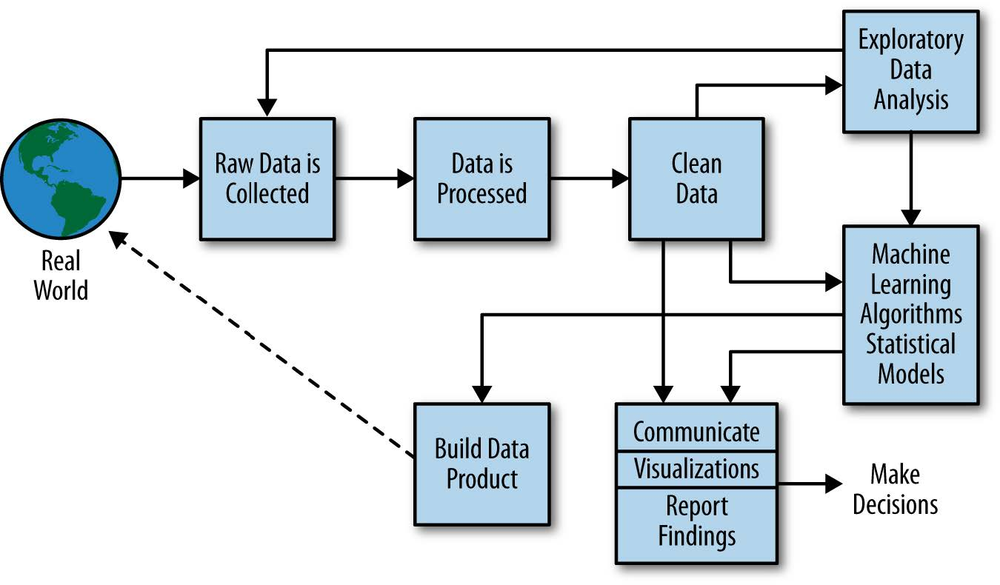

```{css, echo = FALSE}

.huge { font-size: 200% }
.large { font-size: 130% }
.small { font-size: 70% }

```


```{r setup, include=FALSE}

options(htmltools.dir.version = FALSE)

knitr::opts_chunk$set(
  echo=FALSE,
  warning = FALSE,
  message = FALSE,
  fig.width=12, 
  fig.height=5.5, 
  dpi=72*5,
  cache = FALSE
)

library(diagram)
library(tidyverse)
library(tidymodels)
library(survival)
library(gam)
library(glue)
library(gridExtra)
library(knitr)
library(kableExtra)
library(scales)
library(widgetframe)
library(magrittr)
library(pec)

thm  <- theme_bw() + 
  theme(
    text = element_text(size=18, face = 'bold'),
    panel.grid = element_blank()
  )

theme_set(thm)

```


# Hello! My name is Byron 

.left-column[

I like running, walking my dog, bad margaritas, Rocket League, and (of course) R.

I study <br/> machine learning, missing data, ambulatory blood pressure, and cardiovascular disease.

Also, I'm a <br/>Biostatistician!

]

.right-column[


]

---
class: center
background-image: url(figs/scream_face.jpg)
background-position: 50% 70%
background-size: 30%


# Wait.

## Is this a math talk?


---
class: middle, center, inverse

# PART I

# What is Machine Learning?

---
layout: true 
class: center, middle

---

### Machine learning is well known, but common misconceptions abound...

---

### Artificial intelligence is the same thing as machine learning...?

---

### Machine learning is a type of deep learning...?

---

### Everything that involves machine learning involves a black box...?

---

### If these are wrong, what is right?

---
layout: false

# What is ML?

```{r, out.width='100%'}
include_graphics("figs/ai_ml_dl.png")
```

---
background-image: url(figs/ml_diagram.png)
background-size: 90%
background-position: 50% 50%

---
layout: true

# ML vs. Inference

---
background-image: url(figs/stats_inference.png)
background-size: 15%
background-position: 95% 5%

## Statistical Inference

- .large[Forming judgments about the parameters of a population.]

- .large[**Hypothesis** driven (exploring is frowned upon)]

- .large[End-point of analysis is **knowledge**]

--

### Inference $\Rightarrow$ guidelines $\Rightarrow$ decisions $\Rightarrow$ outcomes


---
background-image: url(figs/data_mining.jpg)
background-size: 20%
background-position: 95% 5%

## Supervised Learning 

- .large[Forming a prediction function to engage with uncertainty.]

- .large[**Performance** driven (exploring is necessary)]

- .large[End-point of analysis is a **prediction function**]

--

### Predictions $\Rightarrow$ decisions $\Rightarrow$ outcomes

---
layout: false
class: middle, center

```{r, out.width='90%'}

```

---
class: middle, center

# [Data product demo](https://bcjaeger.shinyapps.io/DPE4NHTN_WebApp/)

---
class: middle, center, inverse

# PART II

# Core Principles of Machine Learning

---
class: middle, center

# Core principal 1:

# Bias-variance tradeoff

---
layout: true
background-image: url(figs/esl.jpg)
background-position: 96% 4%
background-size: 18%

# Core Principles of ML

### Bias-variance tradeoff


---


 You may recognize the terms bias and variance if you have some experience with statistics.

--

- **Bias:** expected difference between observed and predicted values (in derivation data)

- **Variance:** measure of dispersion in the distribution of predicted values.

These are correct (but not helpful) definitions.

---

You may recognize the terms bias and variance if you have some experience with statistics.

- **Bias:** how well does a model predict its derivation data?

- **Variance:** how complex is the model?

These are incorrect (but helpful) definitions.

---

**Example:** Suppose data are $\mathcal{D} = (Y,X)$, where $Y = f(X)$ and $f$ is an unknown function. 

```{r}

nsubs=25
ntst=25000
set.seed(3)
x=runif(nsubs,0,10)
ggdat=data.frame(y=x*(3+sin(pi*x/3))+rnorm(nsubs,sd=x),x=x)
xgrid=seq(min(x),max(x),length.out=100)
truth=data.frame(x=xgrid)%>%mutate(y=x*(3+sin(pi*x/3)))

ggplot(ggdat,aes(x=x,y=y))+geom_point(size=3)+
  labs(title='Simulated Data',x='X-value',y='Y-value')

```

---

**Example:** Suppose data are $\mathcal{D} = (Y,X)$, where $Y = f(X)$ and $f$ is an unknown function. 

```{r}

ggplot(ggdat,aes(x=x,y=y))+geom_point(size=3)+
  labs(title='Simulated Data',x='X-value',y='Y-value')+
  geom_line(data=truth,aes(x=x,y=y),color='red',linetype=2)

your_data <- as_tibble(ggdat)

spars = seq(1.0, 0.3, length.out = 15)
mdl_cmplx = 1:length(spars)
grid_plots = vector(mode = 'list', length = length(spars))
my_data = truth %>% 
  mutate(y = y + rnorm(length(xgrid), sd = xgrid)) %>% 
  as_tibble()

sqr <- function(x)
  x ^ 2


```

---

**Example:** Suppose data are $\mathcal{D} = (Y,X)$, where $Y = f(X)$ and $f$ is an unknown function. 

.pull-left[
**Workflow:** I give you a dataset with 25 observations:
```{r, eval = FALSE, echo=TRUE}
print(your_data)
```
]

.pull-right[
```{r}
print(your_data)
```
]


---

**Example:** Suppose data are $\mathcal{D} = (Y,X)$, where $Y = f(X)$ and $f$ is an unknown function. 

.pull-left[
**Workflow:** I'm keeping a dataset away from you. It has `r nrow(my_data)` observations:
```{r, eval = FALSE, echo=TRUE}
print(my_data)
```
]

.pull-right[
```{r}
print(my_data)
```
]

---

**Example:** Suppose data are $\mathcal{D} = (Y,X)$, where $Y = f(X)$ and $f$ is an unknown function. 

.pull-left[
**Workflow:** I'll give you my $X$ values, and then you'll try to predict what my $Y$ values are 
```{r, eval = FALSE, echo=TRUE}
select(my_data, x)
```
]

.pull-right[
```{r}
select(my_data, x)
```
]

---

**Example:** Suppose data are $\mathcal{D} = (Y,X)$, where $Y = f(X)$ and $f$ is an unknown function. 

.pull-left[
**Workflow:** Let's say your predictions are the mean of your observed $Y$ values, $$\widehat{Y} = \frac{1}{`r nrow(your_data)`}\sum_{i=1}^{`r nrow(your_data)`} (Y_i^{\text{(your data)}})^2$$.

```{r, eval = FALSE, echo=TRUE}

yobs <- my_data$y
yobs[1:10]

yhat <- mean(your_data$y)
yhat

```
]

.pull-right[
```{r}

yobs <- my_data$y
matrix(yobs[1:10], ncol=1)

yhat <- mean(your_data$y)
yhat

```
]

---

**Example:** Suppose data are $\mathcal{D} = (Y,X)$, where $Y = f(X)$ and $f$ is an unknown function. 

.pull-left[
**Workflow:** I will calculate how accurate your predictions are by computing $$\sqrt{\frac{1}{`r nrow(my_data)`}\sum_{i=1}^{`r nrow(my_data)`} (Y_i^{\text{(my data)}}-\widehat{Y})^2}$$
```{r, eval = FALSE, echo=TRUE}

# squared differences
sqr_diffs <- (yobs - yhat)^2
# mean squared error
sqrt(mean(sqr_diffs))

```
]

.pull-right[
```{r}

sqr_diffs <- (yobs - yhat)^2
sqrt(mean(sqr_diffs))

```
]

---

**Example:** Suppose data are $\mathcal{D} = (Y,X)$, where $Y = f(X)$ and $f$ is an unknown function. 

.pull-left[
**Workflow:** That's not a great mean squared error. Maybe we can do better if we develop a function $\widehat{f}(X)$ that predicts $Y$.

```{r, eval = FALSE, echo=TRUE}

model <- ???

```
]

.pull-right[
```{r}

sqrt(mean(sqr_diffs))

```
]

---

```{r, cache=TRUE}


mprf=data.frame(
  cmp=mdl_cmplx,
  trn=0,
  tst=0
)

i=1

for(i in mdl_cmplx){
  
  m=gam(y~s(x,spar=spars[i]),data=ggdat)
  ggdat$prd=predict(m)
  my_data$prd=predict(m,newdata=my_data)
  
  p1=ggplot(ggdat,aes(x=x,y=y))+geom_point(size=3)+
    geom_line(data=my_data,aes(x=x,y=prd),col='blue')+
    geom_line(data=truth,aes(x=x,y=y),linetype=2,col='red')+
    labs(title=paste("derivation data error:",format(round(sqrt(mean(sqr(
      ggdat$y-ggdat$prd))),3),nsmall=3), '\nModel AIC', format(round(
        AIC(m),2),nsmall=2)))
  
  mprf[i,c('trn','tst')]<-c(
    sqrt(mean(sqr(ggdat$y-ggdat$prd))),
    sqrt(mean(sqr(my_data$y-my_data$prd)))
  )
  
  p2=ggplot(mprf%>%
              tidyr::gather(variable,value,-cmp)%>%
              dplyr::filter(value>0)%>%
              dplyr::mutate(cmp=cmp-1),
            aes(x=cmp,y=value,col=variable))+
    geom_point(size=3)+
    thm + theme(legend.position='') + 
    scale_color_brewer(palette='Dark2')+
    labs(y='Model Error',x='Model Complexity',
         title='derivation error (blue) and \nvalidation error (orange)')
  
  if(i>1) p2=p2+geom_line()

  grid_plots[[i]]=arrangeGrob(p1,p2,nrow=1)

}

simulated_data = ggdat

```

```{r, echo=TRUE, eval=FALSE}
# spar = 1 => least complex spline
model <- gam(y ~ s(x, spar=1), data=simulated_data)
```

```{r} 
grid.arrange(grid_plots[[1]]) 
```
---
```{r, echo=TRUE, eval=FALSE}
# spar = 0.95 => a little more wiggle room
model <- gam(y ~ s(x, spar=0.95), data=simulated_data)
```

```{r} 
grid.arrange(grid_plots[[2]]) 
```
---
```{r, echo=TRUE, eval=FALSE}
# spar = 0.90 => a little more wiggle room
model <- gam(y ~ s(x, spar=0.90), data=simulated_data)
```

```{r} 
grid.arrange(grid_plots[[3]]) 
```
---

```{r, echo=TRUE, eval=FALSE}
# spar = 0.85 => more 
model <- gam(y ~ s(x, spar=0.85), data=simulated_data)
```

```{r} 
grid.arrange(grid_plots[[4]]) 
```
---

```{r, echo=TRUE, eval=FALSE}
# spar = 0.80 => more 
model <- gam(y ~ s(x, spar=0.80), data=simulated_data)
```

```{r} 
grid.arrange(grid_plots[[5]]) 
```
---
```{r, echo=TRUE, eval=FALSE}
# spar = 0.75 => more 
model <- gam(y ~ s(x, spar=0.75), data=simulated_data)
```

```{r} 
grid.arrange(grid_plots[[6]]) 
```
---

```{r, echo=TRUE, eval=FALSE}
# spar = 0.70 => more
model <- gam(y ~ s(x, spar=0.70), data=simulated_data)
```

```{r} 
grid.arrange(grid_plots[[7]]) 
```
---
```{r, echo=TRUE, eval=FALSE}
# spar = 0.65 => more (too much?)
model <- gam(y ~ s(x, spar=0.65), data=simulated_data)
```

```{r} 
grid.arrange(grid_plots[[8]]) 
```
---
```{r, echo=TRUE, eval=FALSE}
# spar = 0.60 => more (too much?)
model <- gam(y ~ s(x, spar=0.60), data=simulated_data)
```

```{r} 
grid.arrange(grid_plots[[9]]) 
```
---

```{r, echo=TRUE, eval=FALSE}
# spar = 0.55 => more (too much?)
model <- gam(y ~ s(x, spar=0.55), data=simulated_data)
```

```{r} 
grid.arrange(grid_plots[[10]]) 
```
---

```{r, echo=TRUE, eval=FALSE}
# spar = 0.50 => more (too too much??)
model <- gam(y ~ s(x, spar=0.50), data=simulated_data)
```

```{r} 
grid.arrange(grid_plots[[11]]) 
```
---
```{r, echo=TRUE, eval=FALSE}
# spar = 0.45 => more (much too much!!)
model <- gam(y ~ s(x, spar=0.45), data=simulated_data)
```

```{r} 
grid.arrange(grid_plots[[12]]) 
```

---
layout: false
background-image: url(gifs/cat_snow_gif.gif)
background-position: 50% 60%
background-size: 50%

# In summary...

---
class: inverse, center, middle

# Case Study

---
layout: true
background-image: url(figs/intermacs_logo.jpg)
background-position: 97% 3%
background-size: 15%

# Case Study

### INTERMACS

---

**What is it?**

- Interagency Registry for Mechanically Assisted Circulatory Support

- Contains data from patients with advanced heart failure receiving mechanical circulatory support (MCS). 

---

**Why use it?**

- Patients who elect to receive MCS are at risk for a number of adverse events related to the device, such as death, stroke, malfunction, and infection.

- Targeted medical intervention should be directed to patients at high risk for events. 
    
- But...**who** is at risk? and **what** are they at risk for?

---
layout: false
background-image: url(figs/intermacs_slides/Slide1.PNG)
background-position: 20% 50%
background-size: 120%

# Case Study

### INTERMACS

---
background-image: url(figs/intermacs_slides/Slide2.PNG)
background-position: 20% 50%
background-size: 120%

# Case Study

### INTERMACS

---
background-image: url(figs/intermacs_slides/Slide3.PNG)
background-position: 20% 50%
background-size: 120%

# Case Study

### INTERMACS

---

```{r, include = FALSE}

library(tibbleOne)

mcs <- read_csv('data/dead_M0_25MD.csv',guess_max = 20000) %>% 
  mutate(
    #time = time - 1/4,
    surv_1yr = case_when(
    time < 1 & status == 1 ~ "No", 
    time < 1 & status == 0 ~ "Censored",
    TRUE ~ "Yes"
    ),
    surv_1yr = factor(
      x = surv_1yr,
      levels = c("Yes", "Censored", "No")
    ),
    m0_impl_yr = factor(m0_impl_yr)
  ) %>% 
  mutate_if(is.character, as.factor) %>% 
  filter(time > 0)

```

```{r, results='asis'}

tb1 <- mcs %>% 
  mutate_if(is.character, as.factor) %>% 
  select_labelled(
    surv_1yr = "Survived 1 year",
    m0_age_deident = "Age",
    m0_race_white = 'White',
    m0_impl_yr = "Implant year"
  ) %>% 
  set_variable_units(m0_age_deident = 'years') %>% 
  tibble_one(
    formula = ~ . | surv_1yr, 
    include_freq = TRUE,
  ) %>% 
  to_kable(caption = 'Table 1: INTERMACS patient characteristics') %>% 
  kable_styling()

print(tb1)

```


---
class: center, middle

# Core principal 2:

# External validation

---
layout: true
background-image: url(figs/text_trio.jpg)
background-position: 96% 4%
background-size: 25%

# Core Principles of ML

---

### External validation

**Why is this a core principle?** 

Anyone can predict what they already know. The value of prediction is tied to anticipating *external* information.

**What is external information?**

Data that comes from a different 

- place and / or time.

- research organization and / or team

- instrument

- population

than the derivation data.

---

### External validation with INTERMACS

**Problem:** Develop a function $\widehat{f}(t):$ `r icon::fa_user_circle()` $\rightarrow (0,1]$ 

- $\widehat{f}(t)$ predicts risk for *mortality* at or before $t$.

- $t$ ranges from 1 week to 1 years post MCS surgery.

- `r icon::fa_user_circle()` is **new** patient data collected

    + prior to MCS surgery at a pre-implant visit (variables with prefix `m0`)
    
    + 1 week after MCS surgery at a follow-up visit (variables with prefix `m0_25`)

--

**Question:** How do we know $\widehat{f}(t)$ is accurate?

- Bias-variace tradeoff $\Rightarrow$ we need a relevant set of **new** data to test $\widehat{f}(t)$.

---
layout: false

```{r}

tb1 %>% 
  row_spec(12:13, bold = T, color = "white", background = "red")


```

---
layout: false

```{r}

tb1 %>% 
  row_spec(8:11, bold = T, color = "white", background = "green")


```

---
layout: true
background-image: url(figs/esl.jpg)
background-position: 96% 4%
background-size: 18%

# Core Principles of ML

---

### External validation with INTERMACS

**Problem:** Develop a function $\widehat{f}(t):$ `r icon::fa_user_circle()` $\rightarrow (0,1]$ 

- $\widehat{f}(t)$ predicts risk for *mortality* at or before $t$.

- $t$ ranges from 1 week to 1 years post MCS surgery.

- `r icon::fa_user_circle()` is **new** patient data collected

    + prior to MCS surgery at a pre-implant visit (variables with prefix `m0`)
    
    + 1 week after MCS surgery at a follow-up visit (variables with prefix `m0_25`)

**Question:** How do we know $\widehat{f}(t)$ is accurate?

- Relevant set of **new** data to test $\widehat{f}(t)$: INTERMACS **data from 2016-2017**. `r icon::fa_check(color = 'green')`

- Given $t$, validation outcomes $\in \left\{0, 1\right\} \Rightarrow$ compare observed outcome to $\widehat{f}(t)$

---
layout: true
background-image: url(figs/scream_face.jpg)
background-position: 95% 2.5%
background-size: 13%

# Core Principles of ML


---

### Brier Score

The **Brier score** of a predicted probability $$\widehat{f}(t) \in (0, 1]$$ for an observed event $$Y(t) \in \left\{ 0, 1 \right\}$$ is $$\left( \widehat{f}(t) -  Y(t) \right)^{2}.$$

**Examples** 

- If $\widehat{f}(t) = 0.10$ and $Y=0$, the **Brier score** is $(0.10 - 0.00)^{2} = 0.01$.

- If $\widehat{f}(t) = 0.50$, the **Brier score** is always 0.25. Why?

---

### Brier Score at a given time


```{r}

outcome <- tibble(time = seq(1, 24, length.out = 1000)) %>% 
  mutate(event = as.numeric(time >= 12))

prediction <- outcome %>% 
  mutate(event = exp(time-12) / (1+exp(time-12)))

p1 <- ggplot(outcome, aes(x=time, y=event)) +
  geom_line(color = 'grey', linetype = 2)

p2 <- p1 +
  geom_line(data=prediction, color = 'red', linetype = 1)

p1 + 
  geom_curve(
  x = 12,
  y = 0.20,
  xend = 20, 
  yend = .50,
  color = 'gray',
  linetype = 5
) + 
  annotate(
    geom = 'text',
    label = 'Observed event \nstatus',
    x = 20, 
    y = 0.60,
    size = 6
  )

```

---

### Brier Score at a given time

```{r}

p2 + geom_curve(
  x = 5,
  y = 0.50,
  xend=prediction$time[400], 
  yend=prediction$event[400],
  color = 'red',
  linetype = 5
) + 
  annotate(
    geom = 'text',
    label = 'Predicted event \nprobability',
    x = 5, 
    y = 0.60,
    size = 6
  )

```


---

### Brier Score at a given time

```{r}

p2 + geom_segment(
  x = prediction$time[400],
  y = 0,
  xend = prediction$time[400], 
  yend = prediction$event[400],
  color = 'black',
  linetype = 5
) + 
  geom_point(
    x = prediction$time[400], 
    y = prediction$event[400]
  ) +
  annotate(
    geom = 'text',
    label = glue('Brier score \nat t = {round(prediction$time[400],1)}'),
    x = 8, 
    y = 0.2,
    size = 6
  )

```

---

### Brier Score at another given time


```{r}

p2 + geom_segment(
  x = prediction$time[600],
  y = 1,
  xend = prediction$time[600], 
  yend = prediction$event[600],
  color = 'black',
  linetype = 5
) + 
  geom_point(
    x = prediction$time[600], 
    y = prediction$event[600]
  ) +
  annotate(
    geom = 'text',
    label = glue('Brier score \nat t = {round(prediction$time[600],1)}'),
    x = 17, 
    y = 0.83,
    size = 6
  )

```

---

### Brier Score at many given times


```{r}

p3 = p2 

for(i in seq(300, 700, by = 25)){
  
  p3 = p3 + geom_segment(
    x = prediction$time[i],
    y = if(i >= 500) 1 else 0,
    xend = prediction$time[i], 
    yend = prediction$event[i],
    color = 'black',
    linetype = 5
  ) + 
    geom_point(
      x = prediction$time[i], 
      y = prediction$event[i]
    )
  
}

p3 + 
  annotate(
    geom = 'text',
    label = 'Lots of Brier scores!',
    x = 17, 
    y = 0.50,
    size = 6
  )

```

---

### Integrated Brier Score

**Why?**

Integrating the Brier score over a range of times summarizes overall prediction accuracy. 

**How?**

Computing Brier scores at all potential times for one observation, i.e.,

$$\text{ibs}(T) = \frac{1}{\text{T}} \int_{0}^{T} \left(\widehat{f}(t) - Y(t) \right)^{2} dt$$

For a validation sample with $N$ observations, 

$$\text{IBS}(T) = \frac{1}{N} \sum_{i=1}^N \text{ibs}_i(T)$$


---

### Scaled Brier Score

**Why?**

- IBS = 0 $\Rightarrow$ perfect model. Great! What if IBS = 0.05?

- IBS = 0.25 $\Rightarrow$ non-informative model, if the outcome has 50% prevalence.

- Max IBS is determined by the prevalence of the outcome.

**How?** 

If the outcome is present in 10% of the population, then the max IBS is 

$$(0.1) \cdot (1–0.1)^{2} + (1–0.1) \cdot (0.1)^{2} = 0.090$$ 

So if our model gets an IBS of 0.05, we could scale it to be $\leq 1$ using 

$$1 - \frac{0.05}{0.090} = 0.444$$

---

layout: true
background-image: url(figs/esl.jpg)
background-position: 96% 4%
background-size: 18%

# Core Principles of ML

---

### External validation with INTERMACS

**Problem:** Develop a function $\widehat{f}(t):$ `r icon::fa_user_circle()` $\rightarrow (0,1]$ 

- $\widehat{f}(t)$ predicts risk for *mortality* at or before $t$.

- $t$ ranges from 1 week to 1 years post MCS surgery.

- `r icon::fa_user_circle()` is **new** patient data collected

    + prior to MCS surgery at a pre-implant visit (variables with prefix `m0`)
    
    + 1 week after MCS surgery at a follow-up visit (variables with prefix `m0_25`)

**Question:** How do we know $\widehat{f}(t)$ is accurate?

- Relevant set of **new** data to test $\widehat{f}(t)$: INTERMACS **data from 2016-2017**. `r icon::fa_check(color = 'green')`

- Compare observed outcome to $\widehat{f}(t)$ using the **scaled integrated Brier score**. `r icon::fa_check(color = 'green')`

```{r}

mcs$surv_1yr = NULL
mcs$m0_impl_yr %<>% as.character() %>% as.numeric()

```

---
layout: true

# Case study

---
background-image: url(hex_stickers/PNG/dplyr.png)
background-position: 95% 2.5%
background-size: 13%

### ML workflow for INTERMACS

Make the derivation / validation sets

.pull-left[

```{r, echo = TRUE, eval = FALSE}

derivation <- mcs %>% 
  filter(
    m0_impl_yr >= 2012,
    m0_impl_yr <= 2015
  ) %>% 
  select(-m0_impl_yr)

validation <- mcs %>% 
  filter(
    m0_impl_yr >= 2016
  ) %>% 
  select(-m0_impl_yr)

dim(derivation)

dim(validation)

dim(mcs)

```


]

.pull-right[

```{r, echo = FALSE, eval = TRUE}

derivation <- mcs %>% 
  filter(
    m0_impl_yr >= 2012,
    m0_impl_yr <= 2015
  ) %>% 
  select(-m0_impl_yr)

validation <- mcs %>% 
  filter(m0_impl_yr >= 2016) %>% 
  select(-m0_impl_yr)

dim(derivation)

dim(validation)

dim(mcs)
```


]

---
background-image: url(hex_stickers/PNG/recipes.png)
background-position: 95% 2.5%
background-size: 13%

### ML workflow for INTERMACS

The R package, `recipes`, lets you specify step-by-step instructions for data pre-processing.

The pre-processing steps applied here:

1. impute continuous variables to the mean,

2. impute categorical variables to the mode.

```{r, echo = TRUE}

reci <- recipe(
  formula = time + status ~ ., 
  data = derivation
) %>% 
  step_meanimpute(all_numeric()) %>% 
  step_modeimpute(all_nominal()) %>% 
  prep()

```

---
background-image: url(hex_stickers/PNG/recipes.png)
background-position: 95% 2.5%
background-size: 13%

### ML workflow for INTERMACS

The R package, `recipes`, lets you specify step-by-step instructions for data pre-processing.

```{r}

reci

```

---
background-image: url(hex_stickers/PNG/recipes.png)
background-position: 95% 2.5%
background-size: 13%

### ML workflow for INTERMACS

`.derivation` and `.validation` represent pre-processed versions of `derivation` and `validation`. (In this case, pre-processed = imputed).

```{r, echo = TRUE}

# pre-processed derivation / validation data
.derivation <- juice(reci)
.validation <- bake(reci, new_data = validation)

dim(na.omit(derivation))
dim(na.omit(.derivation))

```


---
background-image: url(hex_stickers/PNG/recipes.png)
background-position: 95% 2.5%
background-size: 13%

### ML workflow for INTERMACS

`btimes` is a sequence comprising all of the times we will evaluate predicted risk for mortality.

```{r, echo = TRUE}

# times to evaluate predictions
btimes <- seq(min(validation$time), 12, length.out = 500)

btimes[1:10]

```

---
background-image: url(figs/intermacs_model_table.png)
background-position: 50% 70%
background-size: 80%

---
background-image: url(figs/intermacs_model_table_edited.jpg)
background-position: 50% 70%
background-size: 80%

---
background-image: url(figs/intermacs_logo.jpg)
background-position: 97% 3%
background-size: 15%

### ML workflow for INTERMACS

```{r}

ref_data <- list(
  derivation = .derivation,
  validation = .validation   
) %>% 
  map(
    .f = function(df){
      mutate(
        df, 
        ccs = m0_px_profile == '1 Critical Cardiogenic Shock',
        ccs = as.numeric(ccs),
        current_smoker = if_else(
          m0_cc_curr_smoking_m == "Yes" | 
            m0_cc2_curr_smoking_m == "Yes",
          true = 1, 
          false = 0
        ),
        periph_vasc = if_else(
          m0_cc_periph_vasc_disease_m == "Yes" | 
            m0_cc2_periph_vasc_disease_m == "Yes",
          true = 1, 
          false = 0
        ),
        non_comp = if_else(
          m0_cc2_rptd_non_compliance_m == 'Yes' | 
            m0_cc_rptd_non_compliance_m == 'Yes',
          true = 1, 
          false = 0
        ),
        age2 = m0_age_deident^2,
        bmi = m0_wgt_kg / (m0_hgt_cm/100)^2
      ) %>%
        # select(
        #   time,
        #   status,
        #   age2,
        #   bmi,
        #   ccs,
        #   periph_vasc,
        #   current_smoker,
        #   non_comp,
        #   m0_ra_pres,
        #   m0_cv_pres,
        #   m0_bili_total_mg_dl,
        #   m0_lvedd,
        #   m0_intervention_48_hrs_dialysis,
        #   m0_bun_mg_dl,
        #   m0_albumin_g_dl,
        #   m0_prev_cardiac_oper_none,
        # ) %>% 
        mutate_if(is.character, as.factor)
    }
  )

.derivation <- ref_data$derivation
.validation <- ref_data$validation

```


`frm_1` is a model formula comprising variables listed in the early hazard phase.

```{r, echo = TRUE}

# expert model formula 

frm_1 <- Surv(time, status) ~ 
  age2 + # age squared 
  ccs +  # critical cardiogenic shock
  m0_cv_pres + # central venous pressure
  m0_bili_total_mg_dl + # bilirubin
  m0_lvedd + # left ventricular end-diastolic dimension
  m0_intervention_48_hrs_dialysis + # prior to surgery
  m0_bun_mg_dl + # blood urea nitrogen
  m0_albumin_g_dl + # urinary albumin
  m0_prev_cardiac_oper_none # no previous heart operation

```

---

background-image: url(hex_stickers/PNG/pipe.png)
background-position: 95% 2.5%
background-size: 13%


```{r}

ibs_scale <- function(
  object,
  newdata,
  eval_times,
  time = 'time',
  status = 'status'
) {
  
  formula <- glue("Surv({time}, {status}) ~ 1")
  
  .dots <- list(
    object = object,
    formula = as.formula(formula),
    data = newdata[, c(time, status)],
    times = eval_times,
    start = eval_times[1],
    maxtime = eval_times[length(eval_times)],
    exact = FALSE
  )
  
  BS <- suppressMessages(do.call(pec, .dots)) 
  
  IBS <- as.numeric(ibs(BS))
  
  1 - IBS[-1] / IBS[1]
  
}

```

ML workflow using `%>%` (read as **then**).

1. Fit the Cox Proportional Hazards (`coxph`) model, **then**

2. using the `coxph` model, predict survival probabilities in the `.validation` data, **then**

3. using the predicted survival probabilities at all of the `btimes`, compute the IBS.

```{r, echo = TRUE}

ibs_cph_1 <- coxph(frm_1, data = .derivation, x = TRUE) %>% 
  predictSurvProb(newdata = .validation, times = btimes) %>% 
  ibs_scale(newdata = .validation, eval_times = btimes)

ibs_cph_1

```

---

background-image: url(hex_stickers/PNG/pipe.png)
background-position: 95% 2.5%
background-size: 13%


What if we use week 1 follow-up data instead of pre-implant data?

```{r, echo = TRUE}

frm_2 <- Surv(time, status) ~ 
  age2 + # age squared 
  ccs +  # critical cardiogenic shock
  m0_25_cv_pres + # central venous pressure
  m0_25_bili_total_mg_dl + # bilirubin
  m0_25_lvedd + # left ventricular end-diastolic dimension
  m0_intervention_48_hrs_dialysis + # prior to surgery
  m0_25_bun_mg_dl + # blood urea nitrogen
  m0_25_albumin_g_dl + # urinary albumin
  m0_prev_cardiac_oper_none # no previous heart operation


ibs_cph_2 <- coxph(frm_2, data = .derivation, x = TRUE) %>% 
  predictSurvProb(newdata = .validation, times = btimes) %>% 
  ibs_scale(newdata = .validation, eval_times = btimes)

ibs_cph_2


```

---
background-image: url(hex_stickers/PNG/purrr.png)
background-position: 95% 2.5%
background-size: 13%

We can clean this iterative code up with `purrr::map()`

```{r, warning=FALSE, echo = TRUE}

ibs_vals <- list(
  `Pre-implant data` = frm_1,
  `Week 1 follow-up data` = frm_2
) %>% 
  map_dbl(
    .f = ~ coxph(.x, data = .derivation, x = TRUE) %>% 
      predictSurvProb(newdata = .validation, times = btimes) %>% 
      ibs_scale(newdata = .validation, eval_times = btimes)
  )

ibs_vals

```

---

background-image: url(hex_stickers/PNG/knitr.png)
background-position: 95% 2.5%
background-size: 13%

And clean up the presentation with `knitr::kable()` + `kableExtra`

<br/>

```{r}

cap <- "Table 2: Validation of two models using 2016-2017 INTERMACS data"

enframe(ibs_vals) %>% 
  mutate(perc_impr = round(100 * (value / value[1] - 1))) %>% 
  kable(
    caption = cap,
    digits = 3,
    col.names = c('Model', 'Scaled Brier', "% Improvement")
  ) %>% 
  kable_styling(bootstrap_options = c("striped", "hover"), full_width = TRUE)

```

---
layout: true
class: center, middle

---

# Just a second

---

## Should we really impute missing values using mean/mode?

---

## Should we be using proportional hazards?

---

## What happened to the other 500-ish variables?

---

## Is this the best (scaled & integrated) Brier score we can get?

---

# Core principal 3:

# Modeling algorithms

---
layout: false
background-image: url(hex_stickers/PNG/tidymodels.png)
background-position: 95% 2.5%
background-size: 13%

# Core Principles of ML

### Modeling algorithms

**Definition**

Think about the steps taken to develop a prediction function, $\widehat{f}$. 

--

That's the ad-hoc modeling algorithm definition. More formally, there are phases: 

--

- **Data pre-processing**

    + Check validity of the data, handle missing values, handle factor levels, scale/center continuous variables, create new predictor variables, handle outliers, and much more.

- **Model development**

    + Select models, tuning parameters, and predictor variables to use, then fit the model(s).
    
---
layout: true 
background-image: url(hex_stickers/PNG/tidymodels.png)
background-position: 95% 2.5%
background-size: 13%

# Core Principles of ML

---

### Case study

We have seen results using a standard pre-processing `recipe` mean and mode imputation).

What might happen if we applied nearest neighbor imputation instead?

```{r, echo = TRUE, eval = FALSE}

reci <- recipe(
  formula = time + status ~ ., 
  data = derivation
) %>% 
  step_knnimpute(all_predictors()) %>%  
  prep()

.knn_derivation <- juice(reci)
.knn_validation <- bake(reci, new_data = validation)

```

---

```{r}
ibs_vals <- list(
  `Pre-implant data` = frm_1,
  `Week 1 follow-up data` = frm_2
) %>% 
  map_dbl(
    .f = ~ coxph(.x, data = .derivation, x = TRUE) %>% 
      predictSurvProb(newdata = .validation, times = btimes) %>% 
      ibs_scale(newdata = .validation, eval_times = btimes)
  )

ibs_vals
```


---

<!-- --- -->
<!-- class: middle, center -->

<!-- # Resampling -->

<!-- --- -->
<!-- layout: true -->
<!-- background-image: url(hex_stickers/PNG/rsample.png) -->
<!-- background-position: 95% 2.5% -->
<!-- background-size: 13% -->

<!-- # Core Principles of ML -->

<!-- ### Resampling -->

<!-- --- -->

<!-- **Definition:** Randomly drawing samples (with or without replacement) from a derivation dataset. -->

<!-- **Applications:**  -->

<!--   *Statistical inference:* Bootstrap resampling can be used to estimate distributions of parameters with unknown distributions.  -->

<!-- - The difference between correlated $R^2$ statistics. -->

<!-- *Predictive analytics:* Estimate the error of a prediction rule when it is applied to new data. -->

<!-- - Cross-validation -->
<!-- - Bootstrap validation -->
<!-- - Monte-carlo validation (focus for today) -->

