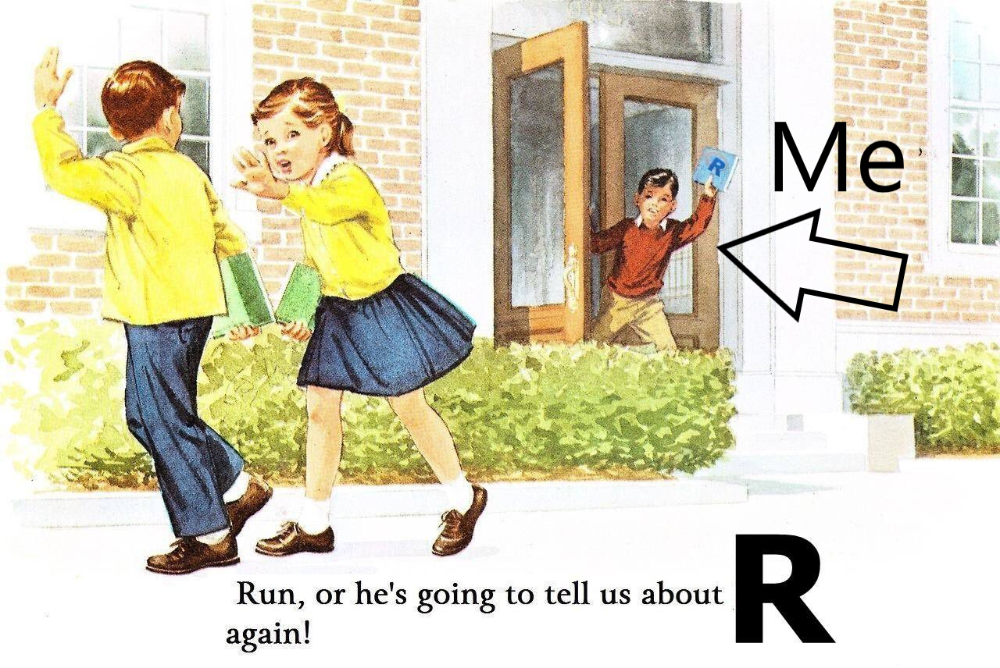

```{css, echo = FALSE}

.huge { font-size: 200% }
.large { font-size: 130% }
.small { font-size: 70% }

```


```{r setup, include=FALSE}

options(htmltools.dir.version = FALSE)

knitr::opts_chunk$set(
  echo=FALSE,
  warning = FALSE,
  message = FALSE,
  fig.width=12, 
  fig.height=6, 
  dpi=72*5,
  cache=FALSE
)

library(diagram)
library(tidyverse)
library(gam)
library(gridExtra)
library(knitr)
library(kableExtra)
library(scales)
library(widgetframe)
library(magrittr)

thm  <- theme_bw() + 
  theme(
    text = element_text(size=18, face = 'bold'),
    panel.grid = element_blank()
  )

theme_set(thm)

```


# Hello! My name is Byron 

.left-column[

I like running, walking my dog, bad margaritas, Rocket League, and (of course) R.

I study <br/> machine learning, missing data, ambulatory blood pressure, and cardiovascular disease.

]

.right-column[



]

---
class: middle, center

# PART I

# What is Machine Learning?

---
layout: true 
class: center, middle

---

### Machine learning is well known, but common misconceptions abound...

---

### Artificial intelligence is the same thing as machine learning...?

---

### Machine learning is a type of deep learning...?

---

### Everything that involves machine learning involves a black box...?

---

### If these are wrong, what is right?

---
layout: false

# What is ML?

```{r, out.width='100%'}

```

---
background-image: url(figs/ml_diagram.png)
background-size: 90%
background-position: 50% 50%

---
layout: true

# ML vs. Inference

---

## Statistical Inference

- .large[Forming judgments about the parameters of a population.]

- .large[**Hypothesis** driven (exploring is frowned upon)]

- .large[End-point of analysis is **knowledge**]

--

### Inference $\Rightarrow$ guidelines $\Rightarrow$ decisions $\Rightarrow$ outcomes


---

## Supervised Learning 

- .large[Forming a prediction function to engage with uncertainty.]

- .large[**Performance** driven (exploring is necessary)]

- .large[End-point of analysis is a **prediction function**]

--

### Predictions $\Rightarrow$ decisions $\Rightarrow$ outcomes

---
layout: false
class: middle, center

```{r, out.width='90%'}

```

---
class: middle, center

# [Data product demo](https://bcjaeger.shinyapps.io/DPE4NHTN_WebApp/)

---
class: middle, center

# PART II

# Core Principles of Machine Learning

---
layout: true
background-image: url(hex_stickers/PNG/tidymodels.png)
background-position: 95% 2.5%
background-size: 13%

# Core Principles of ML

---

### Bias-variance tradeoff

 You may recognize the terms bias and variance if you have some experience with statistics.

--

- **Bias:** expected difference between observed and predicted values (in training data)

- **Variance:** measure of dispersion in the distribution of predicted values.

These are correct (but not helpful) definitions.

---

### Bias-variance tradeoff

You may recognize the terms bias and variance if you have some experience with statistics.

- **Bias:** how well does a model predict its training data?

- **Variance:** how complex is the model?

These are incorrect (but helpful) definitions.

---

**Example:** Suppose data have the form $\mathcal{D} = (Y,X)$, where $Y = f(X)$, and $f$ is an unknown function. 

```{r}

nsubs=25
ntst=25000
set.seed(3)
x=runif(nsubs,0,10)
ggdat=data.frame(y=x*(3+sin(pi*x/3))+rnorm(nsubs,sd=x),x=x)
xgrid=seq(min(x),max(x),length.out=100)
truth=data.frame(x=xgrid)%>%mutate(y=x*(3+sin(pi*x/3)))

ggplot(ggdat,aes(x=x,y=y))+geom_point(size=3)+
  labs(title='Simulated Data',x='X-value',y='Y-value')

```

---

**Example:** Suppose data have the form $\mathcal{D} = (X,Y)$, where $Y = f(X)$, and $f$ is an unknown function. (Okay - I know $f$, but you have to estimate it)

```{r}

ggplot(ggdat,aes(x=x,y=y))+geom_point(size=3)+
  labs(title='Simulated Data',x='X-value',y='Y-value')+
  geom_line(data=truth,aes(x=x,y=y),color='red',linetype=2)

your_data <- as_tibble(ggdat)

spars = seq(1.0, 0.3, length.out = 15)
mdl_cmplx = 1:length(spars)
grid_plots = vector(mode = 'list', length = length(spars))
my_data = truth %>% 
  mutate(y = y + rnorm(length(xgrid), sd = xgrid)) %>% 
  as_tibble()

sqr <- function(x)
  x ^ 2


```

---

**Example:** Suppose data have the form $\mathcal{D} = (X,Y)$, where $Y = f(X)$, and $f$ is an unknown function. (Okay - I know $f$, but you have to estimate it)

.pull-left[
**Workflow:** I give you a dataset with 25 observations:
```{r, eval = FALSE, echo=TRUE}
print(your_data)
```
]

.pull-right[
```{r}
print(your_data)
```
]


---

**Example:** Suppose data have the form $\mathcal{D} = (X,Y)$, where $Y = f(X)$, and $f$ is an unknown function. (Okay - I know $f$, but you have to estimate it)

.pull-left[
**Workflow:** I'm keeping a dataset away from you. It has `r nrow(my_data)` observations:
```{r, eval = FALSE, echo=TRUE}
print(my_data)
```
]

.pull-right[
```{r}
print(my_data)
```
]

---

**Example:** Suppose data have the form $\mathcal{D} = (X,Y)$, where $Y = f(X)$, and $f$ is an unknown function. (Okay - I know $f$, but you have to estimate it)

.pull-left[
**Workflow:** I'll give you my $X$ values, and then you'll try to predict what my $Y$ values are 
```{r, eval = FALSE, echo=TRUE}
select(my_data, x)
```
]

.pull-right[
```{r}
select(my_data, x)
```
]

---

**Example:** Suppose data have the form $\mathcal{D} = (X,Y)$, where $Y = f(X)$, and $f$ is an unknown function. (Okay - I know $f$, but you have to estimate it)

.pull-left[
**Workflow:** Let's say your predictions are the mean of your observed $Y$ values, $$\widehat{Y} = \frac{1}{`r nrow(your_data)`}\sum_{i=1}^{`r nrow(your_data)`} (Y_i^{\text{(your data)}})^2$$.

```{r, eval = FALSE, echo=TRUE}

yobs <- my_data$y
yobs[1:10]

yhat <- mean(your_data$y)
yhat

```
]

.pull-right[
```{r}

yobs <- my_data$y
matrix(yobs[1:10], ncol=1)

yhat <- mean(your_data$y)
yhat

```
]

---

**Example:** Suppose data have the form $\mathcal{D} = (X,Y)$, where $Y = f(X)$, and $f$ is an unknown function. (Okay - I know $f$, but you have to estimate it)

.pull-left[
**Workflow:** I will calculate how accurate your predictions are by computing $$\frac{1}{`r nrow(my_data)`}\sum_{i=1}^{`r nrow(my_data)`} (Y_i^{\text{(my data)}}-\widehat{Y})^2$$
```{r, eval = FALSE, echo=TRUE}

# squared differences
sqr_diffs <- (yobs - yhat)^2
# mean squared error
mean(sqr_diffs)

```
]

.pull-right[
```{r}

sqr_diffs <- (yobs - yhat)^2
mean(sqr_diffs)

```
]

---

**Example:** Suppose data have the form $\mathcal{D} = (X,Y)$, where $Y = f(X)$, and $f$ is an unknown function. (Okay - I know $f$, but you have to estimate it)

.pull-left[
**Workflow:** That's not a great mean squared error. Maybe we can do better if we develop a function $\widehat{f}(X)$ that predicts $Y$.

```{r, eval = FALSE, echo=TRUE}

model <- ???

```
]

.pull-right[
```{r}

yhat

```
]

---

```{r, cache=TRUE}


mprf=data.frame(
  cmp=mdl_cmplx,
  trn=0,
  tst=0
)

i=1

for(i in mdl_cmplx){
  
  m=gam(y~s(x,spar=spars[i]),data=ggdat)
  ggdat$prd=predict(m)
  my_data$prd=predict(m,newdata=my_data)
  
  p1=ggplot(ggdat,aes(x=x,y=y))+geom_point(size=3)+
    geom_line(data=my_data,aes(x=x,y=prd),col='blue')+
    geom_line(data=truth,aes(x=x,y=y),linetype=2,col='red')+
    labs(title=paste("derivation data error:",format(round(sqrt(mean(sqr(
      ggdat$y-ggdat$prd))),3),nsmall=3), '\nModel AIC', format(round(
        AIC(m),2),nsmall=2)))
  
  mprf[i,c('trn','tst')]<-c(
    sqrt(mean(sqr(ggdat$y-ggdat$prd))),
    sqrt(mean(sqr(my_data$y-my_data$prd)))
  )
  
  p2=ggplot(mprf%>%
              tidyr::gather(variable,value,-cmp)%>%
              dplyr::filter(value>0)%>%
              dplyr::mutate(cmp=cmp-1),
            aes(x=cmp,y=value,col=variable))+
    geom_point(size=3)+
    thm + theme(legend.position='') + 
    scale_color_brewer(palette='Dark2')+
    labs(y='Model Error',x='Model Complexity',
         title='derivation error (blue) and \ntesting error (orange)')
  
  if(i>1) p2=p2+geom_line()

  grid_plots[[i]]=arrangeGrob(p1,p2,nrow=1)

}

simulated_data = ggdat

```

```{r, echo=TRUE, eval=FALSE}
# spar = 1 => least complex spline
model <- gam(y ~ s(x, spar=1), data=simulated_data)
```

```{r} 
grid.arrange(grid_plots[[1]]) 
```
---
```{r, echo=TRUE, eval=FALSE}
# spar = 0.95 => a little more wiggle room
model <- gam(y ~ s(x, spar=0.95), data=simulated_data)
```

```{r} 
grid.arrange(grid_plots[[2]]) 
```
---
```{r, echo=TRUE, eval=FALSE}
# spar = 0.90 => a little more wiggle room
model <- gam(y ~ s(x, spar=0.90), data=simulated_data)
```

```{r} 
grid.arrange(grid_plots[[3]]) 
```
---

```{r, echo=TRUE, eval=FALSE}
# spar = 0.85 => more 
model <- gam(y ~ s(x, spar=0.85), data=simulated_data)
```

```{r} 
grid.arrange(grid_plots[[4]]) 
```
---

```{r, echo=TRUE, eval=FALSE}
# spar = 0.80 => more 
model <- gam(y ~ s(x, spar=0.80), data=simulated_data)
```

```{r} 
grid.arrange(grid_plots[[5]]) 
```
---
```{r, echo=TRUE, eval=FALSE}
# spar = 0.75 => more 
model <- gam(y ~ s(x, spar=0.75), data=simulated_data)
```

```{r} 
grid.arrange(grid_plots[[6]]) 
```
---

```{r, echo=TRUE, eval=FALSE}
# spar = 0.70 => more
model <- gam(y ~ s(x, spar=0.70), data=simulated_data)
```

```{r} 
grid.arrange(grid_plots[[7]]) 
```
---
```{r, echo=TRUE, eval=FALSE}
# spar = 0.65 => more (too much?)
model <- gam(y ~ s(x, spar=0.65), data=simulated_data)
```

```{r} 
grid.arrange(grid_plots[[8]]) 
```
---
```{r, echo=TRUE, eval=FALSE}
# spar = 0.60 => more (too much?)
model <- gam(y ~ s(x, spar=0.60), data=simulated_data)
```

```{r} 
grid.arrange(grid_plots[[9]]) 
```
---

```{r, echo=TRUE, eval=FALSE}
# spar = 0.55 => more (too much?)
model <- gam(y ~ s(x, spar=0.55), data=simulated_data)
```

```{r} 
grid.arrange(grid_plots[[10]]) 
```
---

```{r, echo=TRUE, eval=FALSE}
# spar = 0.50 => more (too too much??)
model <- gam(y ~ s(x, spar=0.50), data=simulated_data)
```

```{r} 
grid.arrange(grid_plots[[11]]) 
```
---
```{r, echo=TRUE, eval=FALSE}
# spar = 0.45 => more (much too much!!)
model <- gam(y ~ s(x, spar=0.45), data=simulated_data)
```

```{r} 
grid.arrange(grid_plots[[12]]) 
```

